# DrySpec Building instructions

## Inputs

### Human-first inputs

- [README.md](README.md)
- [SPECIFICATION.md](SPECIFICATION.md)

### Complementary agent-first instructions

How to build DrySpec, for the DrySpec maintenance agents.

- Per-target runtime entrypoint instructions:
  - [build/instructions-codex.md](build/instructions-codex.md)
  - [build/instructions-roocode.md](build/instructions-roocode.md)
- Common instructions sourced by either:
  - [build/instructions.md](build/instructions.md)

## Outputs

`packages/*` (one subdir per target runtime).

The packages are prompts for the agents that assist specification authoring in client projects.

## Building process

Packages are typically never regenerated from scratch. It would be the equivalent of a complete rewrite due to the randomness of LLMs, and cause all of sorts of regressions.

Instead,

1. The human (alone or assisted by a LLM) edits the input files.
2. The agent is pointed at the instructions entrypoint and tasked with propagating the changes to the resulting packages.

```mermaid
flowchart TB

subgraph Edit_Inputs
edit_inputs["🧑 edits inputs"]
--> git_add["git add ."]
end

subgraph Update_Packages
in_diff["git diff --cached"]
entrypoint["build/instructions-xxx.md"]
update["🤖 updates packages/*"]

in_diff --> update
entrypoint --> update
end

Edit_Inputs --> Update_Packages
```

### Prompt

The instructions *are* the prompt, you don't need anything else fancy.

### Model

I use exclusively GPT 5.x High for this task.
